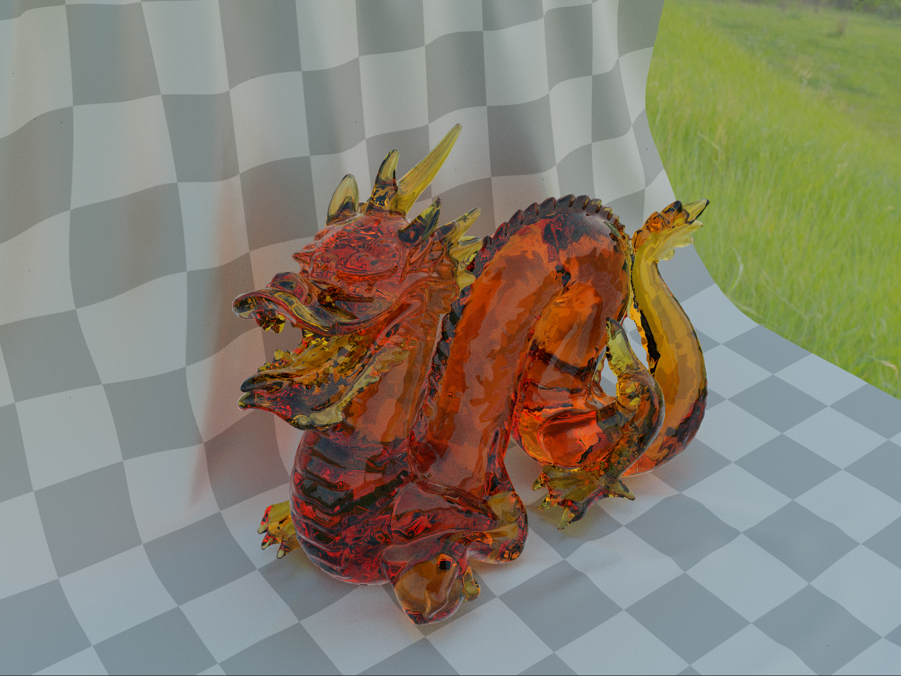

# Vulkan raytracer
Vulkan raytracer is, despite its name, a path tracer written in Vulkan which makes use of hardware accelerated ray tracing. It is based primarily upon glTF material models, and implements a wide array of features including:
- Metallic-roughness material model
- Rough reflections and refractions
- Thin and volume transmission
- Importance sampled BSDFs
- Direct light sampling (analytic and emissive)
- Multiple importance sampling

# Building
1. Run `git submodule update --init --recursive` to fetch external dependencies (see `external` folder)
2. Run `cmake source-directory` to build project

Vulkan SDK and GLSLC are required dependencies.

# Running
Vulkan raytracer requires a GPU that supports raytracing (check [Vulkan Hardware Database](https://vulkan.gpuinfo.org/listdevices.php) to see if your GPU is supported).

The program can be run from the command line:

```
vulkan-raytracer.exe {OPTIONS}

    Vulkan raytracer - a glTF path tracer.
    [WASD] - move around the scene
    [LEFT MOUSE] - pan camera
    [RIGHT MOUSE] - adjust fov

  OPTIONS:

      -h, --help                        Display this help menu
      -r[resolution],
      --resolution=[resolution]         Resolution [w,h]
      Path tracing settings
        -b[maxRayDepth],
        --max-ray-depth=[maxRayDepth]     Max ray depth
      -m[models...],
      --models=[models...]              glTF model file(s)
      Transform modifiers - the n:th
      transform modifier will affect
      the transform of n:th model
      provided. Use comma separated
      list to specify values or 'd' to
      use default value.
        -t[translations...],
        --translations=[translations...]  Model translation(s) [x,y,z]
        -o[rotations...],
        --rotations=[rotations...]        Model rotation(s) [w,x,y,z]
        -s[scales...],
        --scales=[scales...]              Model scale(s) [x,y,z]
      Initial camera settings
        -c[cameraPos],
        --camera-position=[cameraPos]     Camera position [x,y,z]
        -d[cameraDir],
        --camera-direction=[cameraDir]    Camera direction [x,y,z]
      Skybox settings
        --skybox=[skybox]                 Skybox file
        --skybox-strength=[skyboxStrength]
                                          Skybox strength multiplier
```

# Gallery
