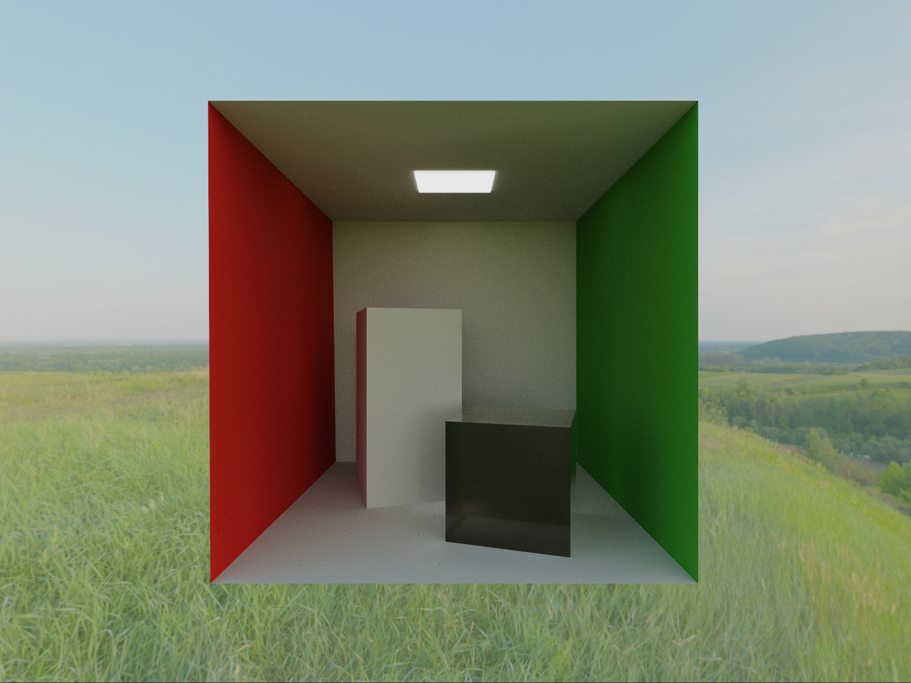

# Vulkan raytracer
Vulkan raytracer is, despite its name, a path tracer written in Vulkan which makes use of hardware accelerated ray tracing. It is based primarily upon glTF material models, and implements a wide array of features including:
- Metallic-roughness material model
- Rough reflections and refractions
- Transmission
- Volume transmission with absorption
- Cook-Torrance BSDF model
- Importance sampled BSDFs (Smith-GGX VNDF sampling, cosine hemisphere sampling)
- Direct light sampling (analytic and emissive)
- Multiple importance sampling

# Building

## Dependencies
Vulkan SDK and GLSLC are required dependencies.

## Build
1. Run `git submodule update --init --recursive` to fetch external dependencies (see `external` folder)
2. Run `cmake source-directory` to build project


# Running
Vulkan raytracer requires a GPU that supports raytracing (check [Vulkan Hardware Database](https://vulkan.gpuinfo.org/listdevices.php) to see if your GPU is supported).


## Example
We want to render a scene at $800 \times 600$ resolution and want to restrict the ray depth to a maximum of $8$. 
We want to construct our scene with the following glTF files, located in the `res/` folder:
- `a.gltf`
    - Identity transform
- `b.gltf`
    - Translated by $T = \begin{bmatrix} 0.5\\1.5\\0.0 \end{bmatrix}$
    - Rotated by 45 degree around y-axis: $q = \frac{\sqrt{2 + \sqrt{2}}}{2} + \frac{\sqrt{2 - \sqrt{2}}}{2} \mathbf{j} \approx 0.924 + 0.383\mathbf{j}$
    - Scaled by $S = \begin{bmatrix} 0.5\\0.5\\0.5\end{bmatrix}$
- `c.gltf`
    - Identiy transform

We would then use the following command:
```
vulkan-raytracer.exe -r 800,600 -b 8 -m a.gltf -t d -o d -s d -m b.gltf -t 0.5,1.5,0 -o 0.924,0,0.383,0 -s 0.5,0.5,0.5 -m c.gltf
```

## Complete list of commands/flags/usage

```
vulkan-raytracer.exe {OPTIONS}

    Vulkan raytracer - a glTF path tracer.
    [WASD] - move around the scene
    [LEFT MOUSE] - pan camera
    [RIGHT MOUSE] - adjust fov

  OPTIONS:

      -h, --help                        Display this help menu
      -r[resolution],
      --resolution=[resolution]         Resolution [w,h]
      Path tracing settings
        -b[maxRayDepth],
        --max-ray-depth=[maxRayDepth]     Max ray depth
      -m[models...],
      --models=[models...]              glTF model file(s)
      Transform modifiers - the n:th
      transform modifier will affect
      the transform of n:th model
      provided. Use comma separated
      list to specify values or 'd' to
      use default value.
        -t[translations...],
        --translations=[translations...]  Model translation(s) [x,y,z]
        -o[rotations...],
        --rotations=[rotations...]        Model rotation(s) [w,x,y,z]
        -s[scales...],
        --scales=[scales...]              Model scale(s) [x,y,z]
      Initial camera settings
        -c[cameraPos],
        --camera-position=[cameraPos]     Camera position [x,y,z]
        -d[cameraDir],
        --camera-direction=[cameraDir]    Camera direction [x,y,z]
      Skybox settings
        --skybox=[skybox]                 Skybox file
        --skybox-strength=[skyboxStrength]
                                          Skybox strength multiplier
```

# Gallery



